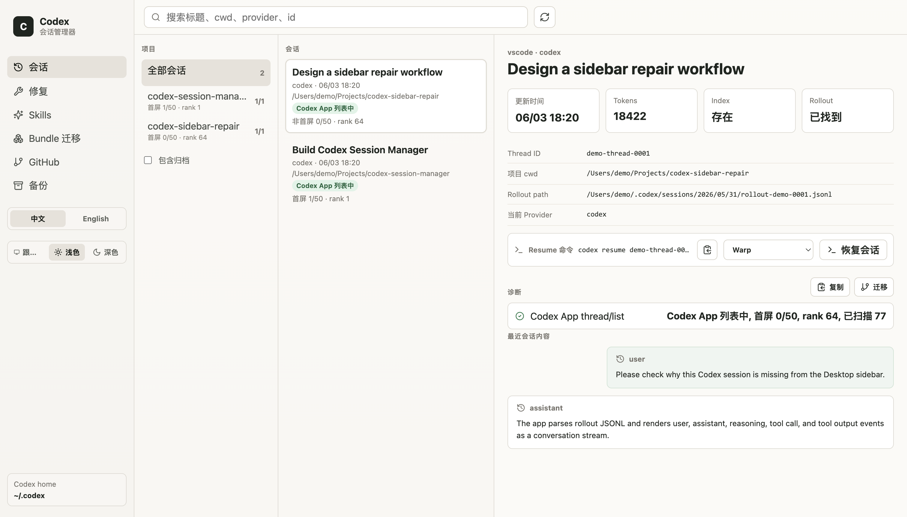

# Codex Session Manager

Codex Session Manager 是一个 Tauri 桌面应用，用于查看、修复、复制、迁移、备份和清理 Codex Desktop/CLI 会话。

它适合经常在多个项目或多个 Provider 之间使用 Codex 的用户，帮助你更安全地判断一个会话为什么会出现在 Codex Desktop 侧边栏、为什么消失，或者为什么搜索得到但无法打开。

[English README](README.en.md)



上方截图来自浏览器预览的 mock 数据，不包含真实本机会话、路径或 Provider 信息。

## 功能说明

- 按项目、标题、Provider、工作目录和 Thread ID 浏览 Codex 会话。
- 将 rollout JSONL 渲染为接近 Codex App 的会话流，支持用户消息、assistant 消息、reasoning、tool call、tool output，以及未知事件折叠为 raw JSON。
- 对照 Codex App 官方 thread list 显示会话状态，并展示 `首屏 1/50`、`rank 64` 等首屏和排序信息。
- 诊断 Desktop 显示问题，包括 `thread_source` 缺失、rollout 路径失效、`session_index.jsonl` 索引缺失、workspace hint 异常、最近线程池被旧记录占满等。
- 所有危险操作先生成 dry-run 预案，不会直接写入。
- 将会话复制到当前 Provider：保留旧会话，创建新会话副本，并记录 `cloned_from`。
- 将会话迁移到当前 Provider：直接修正现有会话 Provider，并同步 Desktop 显示修复。
- 在应用内复制或恢复 `codex resume <thread_id>` 命令，并支持选择终端。
- 管理备份和清理候选项。
- 删除 `~/.codex/archived_sessions/` 下的归档 rollout。
- 删除已复制的旧 Provider 会话时，只列出能通过新 Provider 副本 `cloned_from` 确认关系的旧会话。
- 删除归档 rollout 时，如果同一 session id 仍有 active rollout，会保留 active 索引并把 Desktop thread 指回 active 文件。
- 导出/导入 Codex 会话 bundle 和自定义 skills，默认排除敏感文件。
- 支持界面中英文切换，以及浅色、深色、跟随系统主题。

## 安全模型

这个应用会读取和修改 Codex 状态文件，所以所有写入操作都尽量保守。

- 危险操作从 dry-run 预案开始。
- 应用预案前会先创建备份。
- 备份包含被修改的 Desktop state、SQLite state、session index 和相关 rollout 文件。
- 检测到 Codex App 或活跃 Codex CLI 进程时会阻止写入。
- 执行受保护操作时，用户可以确认是否强制关闭残留的 Codex 进程。
- bundle 默认排除敏感文件，包括 `auth.json`、cookies、tokens、浏览器缓存、crash dumps，以及疑似 secret 的文件。
- 删除归档只针对 `~/.codex/archived_sessions/`。

## 数据来源

后端会扫描和修复这些 Codex 文件：

- `~/.codex/state_5.sqlite`
- `~/.codex/state_5.sqlite-wal`
- `~/.codex/state_5.sqlite-shm`
- `~/.codex/session_index.jsonl`
- `~/.codex/.codex-global-state.json`
- `~/.codex/archived_sessions/`
- `~/.codex/skills/`
- `~/.codex/backups/`
- Desktop thread 行引用的 rollout 路径

判断 Codex App 可见性时，应用会尽量通过 `codex app-server --stdio` 调用官方 Codex App thread list。如果 app-server 不可用，会显示为无法验证，而不是用过宽的本地规则猜测。

## 环境要求

- Node.js 20 或更新版本
- npm
- Rust stable toolchain
- Codex CLI 在 `PATH` 中，用于官方 thread-list 检查
- 本机存在 Codex Desktop/CLI 状态目录 `~/.codex`

同时需要满足 Tauri v2 对各平台的环境要求。

## 安装依赖

```bash
npm ci
```

如果你有意更新依赖版本，可以使用：

```bash
npm install
```

## 开发运行

运行带 Tauri 后端的桌面应用：

```bash
npm run tauri:dev
```

只预览前端 mock 数据：

```bash
npm run dev
```

浏览器预览无法访问真实 Tauri 命令，会使用 `src/tauri.ts` 中的 mock 会话数据，适合调 UI 和生成安全截图。

## macOS 构建方法

安装前置依赖：

```bash
xcode-select --install
rustup default stable
npm ci
```

构建应用：

```bash
npm run tauri:build
```

当前 Tauri 配置会生成 macOS `.app`：

```text
src-tauri/target/release/bundle/macos/Codex Session Manager.app
```

如果需要 `.dmg`，把 `src-tauri/tauri.conf.json` 中的 bundle targets 从：

```json
["app"]
```

改为：

```json
["app", "dmg"]
```

然后重新运行：

```bash
npm run tauri:build
```

## Windows 构建方法

安装前置依赖：

- Node.js 20+
- 通过 `rustup` 安装 Rust stable
- Microsoft C++ Build Tools，或安装带 Desktop development with C++ 工作负载的 Visual Studio 2022
- WebView2 Runtime
- 推荐安装 Git for Windows

安装依赖：

```powershell
npm ci
rustup default stable
```

如果需要 Windows 安装包，把 `src-tauri/tauri.conf.json` 中的 `bundle.targets` 设置为：

```json
["msi"]
```

或：

```json
["nsis"]
```

然后构建：

```powershell
npm run tauri:build
```

常见输出目录：

```text
src-tauri\target\release\bundle\msi\
src-tauri\target\release\bundle\nsis\
```

如果只是想在 Windows 上测试前端，运行 `npm run dev` 即可，它会使用 mock 数据。

## 使用方法

1. 启动 Codex Session Manager。
2. 通过左侧边栏在会话、修复、Skills、Bundle 迁移、GitHub、备份之间切换。
3. 在会话页面，先在第一列选择项目，再在第二列选择具体会话。
4. 在详情面板查看 Thread ID、项目 cwd、rollout path、当前 Provider、Resume 命令、诊断信息和渲染后的会话内容。
5. 通过状态标签判断 Codex App 可见性：
   - `Codex App 列表中`：来自 Codex App 官方 thread list。
   - `本地存在未在列表`：本地有会话，但当前 Codex App thread list 中没有。
   - `无法验证`：Codex App app-server thread list 不可用。
6. 查看首屏和 rank 信息，判断旧项目会话是否因为排在全局最近 50 条之后而没有出现在 Desktop 首屏。
7. 在诊断区域点击复制、迁移或修复。这些按钮会进入操作工作台，不会直接写入。
8. 审阅 dry-run 预案、受影响会话、备份文件、警告和 diff。
9. 确认无误并关闭 Codex App/CLI 后，再执行受保护操作。
10. 使用恢复会话按钮在所选终端中打开 `codex resume <thread_id>`。应用会在项目目录创建临时 `.tmp*` 脚本执行命令，脚本退出后自清理，不申请 macOS 辅助功能权限。

## Provider 复制与迁移

复制到当前 Provider：

- 保留原会话。
- 创建新的 session id 和 rollout 副本。
- 创建新的 Desktop thread 行。
- 在新 Provider 副本中记录 `cloned_from`。

迁移到当前 Provider：

- 直接更新现有会话 Provider。
- 更新 rollout 中的 `session_meta.model_provider`。
- 同步生成 Desktop 显示修复预案。

## 清理功能

清理功能默认保守：

- 删除归档 rollout 只处理 `~/.codex/archived_sessions/`。
- 删除旧 Provider 会话时，只列出能被新 Provider 副本 `cloned_from` 确认关系的会话。
- 旧版重复副本清理先生成 dry-run 预案。
- 如果同一个 session id 仍有 active rollout，会保留 active 索引，并把 Desktop thread 指回 active 文件。

## 备份

写入操作会在修改 Codex 状态前创建备份。备份界面可用于查看、管理和预演恢复。

修复或清理前常见备份文件：

- `state_5.sqlite`
- `state_5.sqlite-wal`
- `state_5.sqlite-shm`
- `.codex-global-state.json`
- `session_index.jsonl`
- 受影响的 rollout 文件

## 测试

```bash
npm test
```

其他检查：

```bash
npm run build
cargo check --manifest-path src-tauri/Cargo.toml
```

完整桌面构建：

```bash
npm run tauri:build
```

## 仓库卫生

不要提交生成产物或本地专用目录：

- `node_modules/`
- `dist/`
- `src-tauri/target/`
- `codex_bundles/`
- 本地对比仓库，例如 `cc-switch/`
- 临时 `.tmp*` resume 脚本

README 中的截图使用安全 mock 数据。如果后续添加更多截图，建议使用浏览器预览或 fixture，不要使用真实 Codex 会话。

## License

本项目使用 MIT 协议，详见 [LICENSE](LICENSE)。
